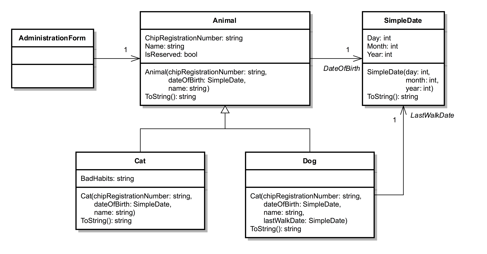

# Dierenasiel

In een dierenasiel worden huisdieren opgevangen. Dit kunnen dieren zijn die
gevonden worden (zwervers) of het kan zijn dat de huidige eigenaar van het
huisdier afstand wil doen.

Voor een asiel moet een applicatie gemaakt worden, waarin gegevens over de
huisdieren worden bijgehouden. Zo wil men snel een overzicht kunnen krijgen van
alle dieren in het asiel en wil men per dier gegevens op kunnen vragen. Indien
een nieuw huisdier bij het dierenasiel binnenkomt, moet deze natuurlijk in het
systeem kunnen worden ingevoerd. Een huisdier moet kunnen worden verkocht aan
een nieuwe eigenaar, etc.

In het asiel worden honden en katten opgevangen. De medewerkers van het
dierenasiel proberen iedere hond één keer per dag uit te laten. Het uitlaten
wordt bij de honden dan ook geregistreerd door voor iedere hond de datum bij te
houden wanneer deze hond voor het laatst is uitgelaten.

Katten worden niet uitgelaten, maar van katten wil men extra informatie over
hun gedrag bij kunnen houden. Men kan dan denken aan informatie, zoals "Is erg
bazig", "Valt andere katten aan", "Kan slecht alleen zijn" en "Niet geschikt
voor kinderen".

Verder kan een toekomstige eigenaar een huisdier reserveren. Zo weet hij zeker
dan iemand anders er niet met zijn favoriete dier vandoor gaat. In de toekomst
hoopt men ook andere dieren op te kunnen vangen, maar voorlopig alleen honden
en katten.

Allereerst gaan we een *eerste versie* voor het administratie systeem maken.
Het systeem kan voor nu maar één hond of één kat administreren.

Om het systeem te implementeren gebruiken we:

 * de klasse `Animal` (is compleet geïmplementeerd).
 * de klasse `Dog` en `Cat` (zijn beiden nog niet af).
 * de GUI klasse `AdministrationForm` (is nog niet af).

Het klassediagram van de code:

## De eerste versie

 1. Download of clone dit project en lees de code en het commentaar door.
 1. Maar de klassen `Dog` en `Cat` af. Zie hiervoor de todo's en het commentaar
 in de code.
 1. Zoek in het bovenstaande klassendiagram het symbool voor inheritance. Op
 welke manier komt dit concept terug in de code?
 1. Gebruik de `AdministrationForm` klasse voor het maken van een user
 interface waarmee de gebruiker een hond of kat aan de administratie kan
 toevoegen. De administratie kan (en moet) op het moment maar één hond of één
 kat bevatten in het field `animal`. Er staan al een aantal controls op het
 formulier. Zie de toelichtingen in de code om te zien wat je hier precies mee
 moet doen. Plaats zelf nog een aantal textboxes en labels voor het invoeren en
 tonen van informatie.
 1. Ga na of je de properties van de `Animal` klasse kunt benaderen voor een
 kat of hond die aan het `animal` field hebt toegekend. Kun je ook de
 specifieke properties van de hond (`LastWalkDate`) of de kat (`BadHabits`)
 benaderen vanuit het `animal` field? Waarom?

